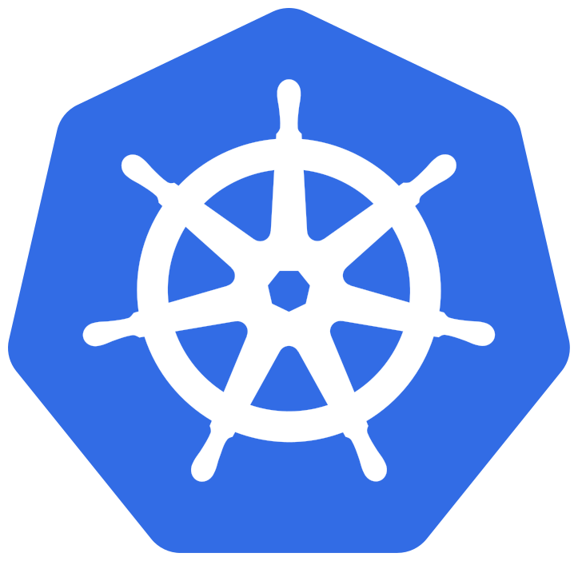

# k8s-playground

This project can be used to try out various frameworks around Kubernetes.

## Table of Contents

- [k8s-playground](#k8s-playground)
  - [Table of Contents](#table-of-contents)
  - [Topics](#topics)
    - [Authentication and Authorization](#authentication-and-authorization)

## Topics

### Authentication and Authorization

To test multiple kubernetes authentication and authorization variants, the section `auth` was created, see [auth/README](auth/README.md).
