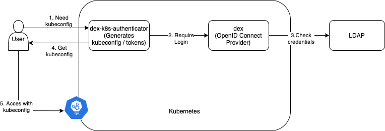
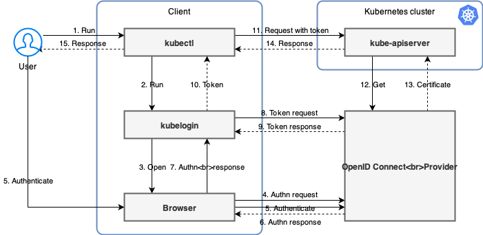

# k8s-playground - Topic Authentication and Authorization

## Table of contents

- [k8s-playground - Topic Authentication and Authorization](#k8s-playground---topic-authentication-and-authorization)
  - [Table of contents](#table-of-contents)
  - [Local minikube demo environment](#local-minikube-demo-environment)
    - [Setup minikube with dex, dex-k8s-authenticator](#setup-minikube-with-dex-dex-k8s-authenticator)
      - [How to use dex-k8s-authenticator](#how-to-use-dex-k8s-authenticator)
    - [Setup minikube with kubelogin](#setup-minikube-with-kubelogin)
      - [How to use kubelogin](#how-to-use-kubelogin)
    - [What it does](#what-it-does)
      - [01_minikube_start.sh](#01_minikube_startsh)
      - [02_certs.sh](#02_certssh)
      - [03_dex.sh](#03_dexsh)
      - [04_minikube_apiserver.sh](#04_minikube_apiserversh)
      - [05_dex-k8s-authenticator.sh](#05_dex-k8s-authenticatorsh)
      - [05_kubelogin.sh](#05_kubeloginsh)
      - [06_openldap.sh](#06_openldapsh)
      - [07_demo-app.sh](#07_demo-appsh)

## Local minikube demo environment

To test multiple kubernetes authentication variants, the `minikube-demo` was created.

### Setup minikube with dex, dex-k8s-authenticator

Simply run the scripts in order:

        ./01_minikube_start.sh
        ./02_certs.sh
        ./03_dex.sh
        ./04_minikube_apiserver.sh
        ./05_dex-k8s-authenticator.sh
        ./06_openldap.sh
        ./07_demo-app.sh

        # Make your tests ;-)
        # See "How to use dex-k8s-authenticator"

        # Remove demo configurations in `~/.kube/config`
        ./99_cleanup.sh

        # Delete minikube-demo
        minikube delete

#### How to use dex-k8s-authenticator

You need the minikube ip:

        # Get minikube ip
        minikube ip

1. First open the dex-k8s-authenticator webpage, should be on `https://dex-k8s-authenticator.<minikube ip>.nip.io/`
1. Login with LDAP (e.g. user: `user01`, password: `password01`) and set up your kubectl
1. Open the demo-app, should be on `https://demo-app.<minikube ip>.nip.io/`
1. To test the RBAC rules, user `user01@alfter-web.de` has read-write permissions to `demo-app` namespace
   1. You can test this by making a change in the ConfigMap `kubectl -n demo-app edit cm demo-app-cm`.
   1. Change `background.color` to `darkblue`

### Setup minikube with kubelogin

Simply run the scripts in order:

        ./01_minikube_start.sh
        ./02_certs.sh
        ./03_dex.sh
        ./04_minikube_apiserver.sh
        ./05_kubelogin.sh
        ./06_openldap.sh
        ./07_demo-app.sh

        # Make your tests ;-)
        # See "How to use kubelogin"

        # Remove demo configurations in `~/.kube/config`
        ./99_cleanup.sh

        # Delete minikube-demo
        minikube delete

#### How to use kubelogin

1. Use `kubectl` e.g. run `kubectl get ns --user=user01`
1. The browser opens and there is a redirect to `TODO`
   1. Login with LDAP (e.g. user: `user01`, password: `password01`)
1. Open the demo-app, should be on `https://demo-app.<minikube ip>.nip.io/`
1. To test the RBAC rules, user `user01@alfter-web.de` has read-write permissions to `demo-app` namespace
   1. You can test this by making a change in the ConfigMap `kubectl --user=user01 -n demo-app edit cm demo-app-cm`.
   1. Change `background.color` to `darkblue`

### What it does

See the scripts for more details.

#### 01_minikube_start.sh

Starts simple minikube instance

#### 02_certs.sh

Generates self-signed tls certificates for subdomains of minikube's ip `*.$( minikube ip ).nip.io`. Copies certificate authority into minikube folder, so _apiserver_ can later see it. __Don't forget to import `ssl/ca.pem` into your browser.__

#### 03_dex.sh

Deploys dex with specific configuration to this minikube instance. There is six static users set with credentials `admin@alfter-web.de:password` and `user[1-5]@alfter-web.de:password`.

#### 04_minikube_apiserver.sh

Configures minikube apiserver with dex as oidc provider.

#### 05_dex-k8s-authenticator.sh

Deploys and configure dex-k8s-authenticator to use dex.

#### 05_kubelogin.sh

Configure kubectl to use kubelogin.

#### 06_openldap.sh

Deploys and configure openldap with some static users. There is two users set with credentials `user01:password01` and `user02:password02`. Both users are members of the group `clusterusers`.

        # Access ldap on port 1389
        kubectl -n openldap port-forward svc/openldap 1389:1389

#### 07_demo-app.sh

Deploys demo-app with some RBAC configurations.

- All users of the ldap group `clusterusers` get the cluster role `view`.
- All users of the ldap group `clusterusers` get the role `read-write` in namespace `demo-app`.
